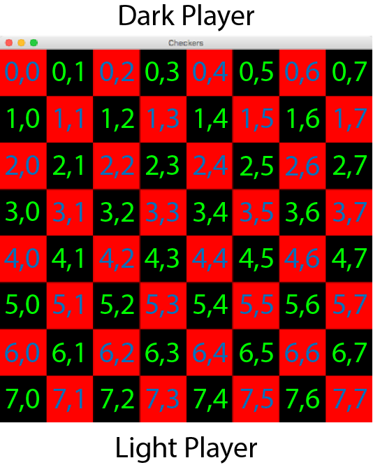
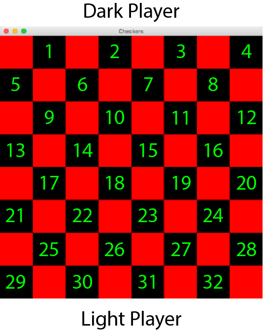

## Checkerboard Model

The board will be represented by a 2 dimensional array in its own class. Because of the way 2D arrays are accessed, it can be thought of as this:

In the image, every tile on the board can be accessed through a row/column format in the same manner as a 2D array. The view can be continuously updated based off of the contents of the array in the model.

The 2D array will contain integers. One possible idea:
- A 0 indicates no piece is present
- A 1 indicates a dark piece is present
- A 2 indicates a light piece is present

And so on.

In addition, the model will need more than just the data to represent the game.
- Player names
- Ability to play player vs. player, computer vs. computer, player vs. computer
- An ability to flip the board around after each turn - This way, both players in a player vs. player game can view the board in the same manner
- If a computer is implemented, a way of scoring each possible state of the board will need to be implemented to handle how the computer makes decisions (Minimax tree)
- Images for checkerboard pieces
- When a piece is hovered, a method and solution to displaying all possible moves for that piece
- Possibility to change color of the board
- Ability to pause and save a game
- Ability to end a game or forfeit a match
- Ability to start a new game without closing the application
- A way to make the winner feel glory and the loser feel shame
- There are probably more that I am missing.

There will also need to be an easier way to implement moves. One possible way to do this is to think of the checkerboard like this image:

To read moves, an input could possibly be given to a function of a start location and an end location for a particular piece. A method to translate the original 2D array to an array like this would be needed if moving like this.

**In the above image:**

If the row number % 2 is equal to 0, a move down and right increases the number by 5, whereas a move down and left or up and left changes the number by +- 4, and a move up and right decreases the number by 3.

If the row number % 2 is equal to 1, a move down and right or up and right changes the number by +- 4, whereas a move down and left increases the number by 3, and a move up and left decreases a number by 5.

In addition, other methods will be needed:
- start()
- save()
- load()
- move() - move to a spot on the board
- checkValid() - check if a move is a valid move
- isGameOver() - return true if one side has no pieces
- (if AI implemented) - Minimax()
- removePiece() - change the data to remove a piece if jumped
- endGame() - forfeit a match
- Name() - give a name to a player
- a method to restrict movement once the game is over
